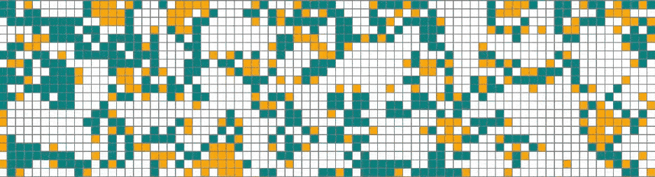
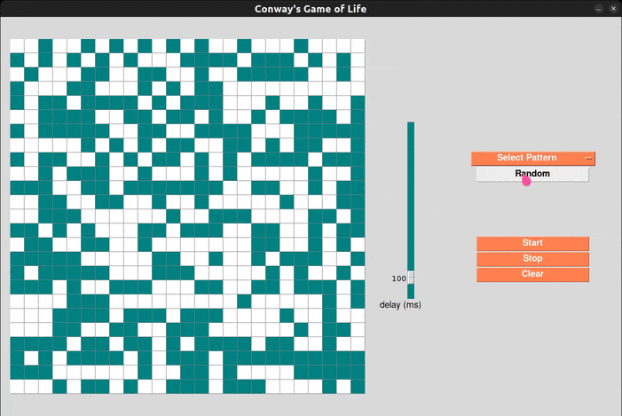
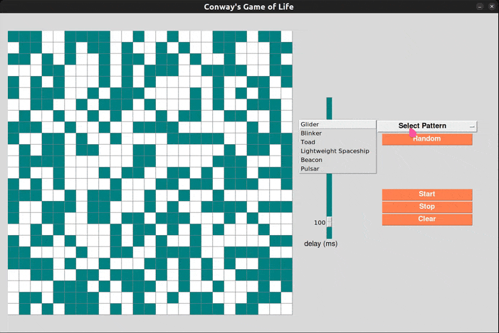
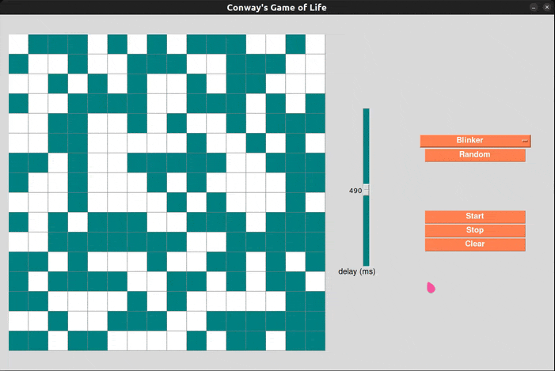
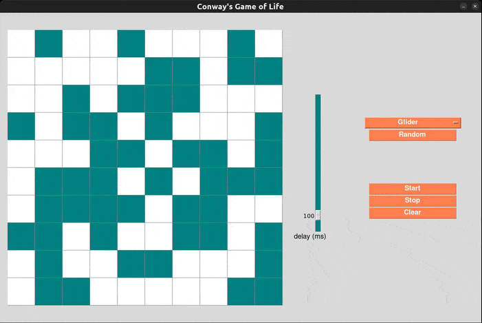
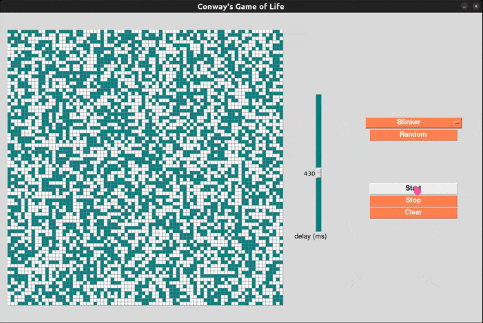
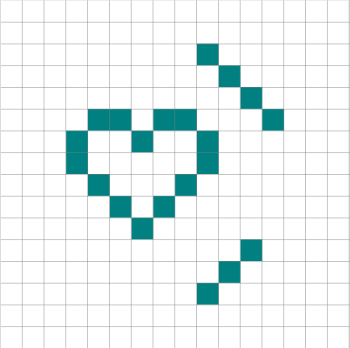
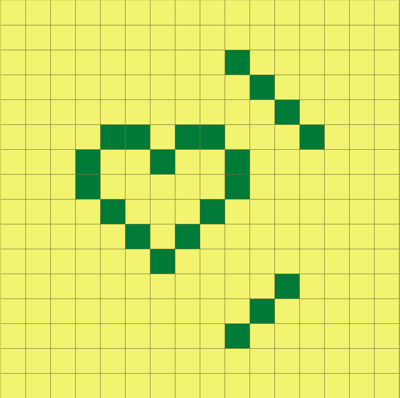
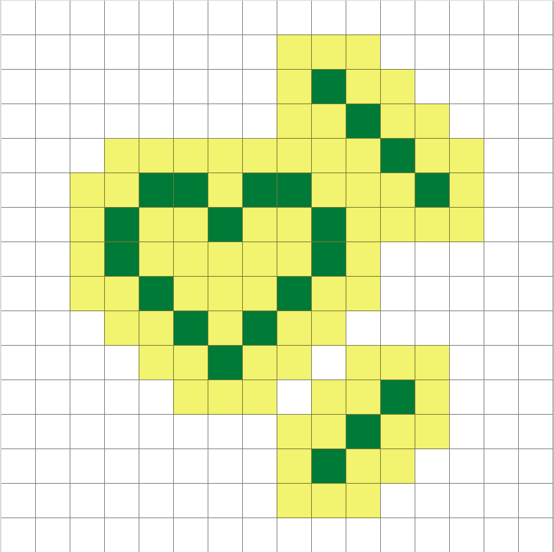

# gameoflife-tk

Conway's Game of Life, as a Tkinter desktop application.
\
This was also our submission for the semi-finals round (round of 4 💻🏆) of the ALX SE Face-Off Cup
\
community competition.

---



---

## How to run the application

### 1. Using executable files

You can find,download and run the executable files for your chosen platform by visiting
\
the releases page [here](https://github.com/josfam/gameoflife-tk/releases/tag/v.1.0.0)

### 2. Running the python code from your terminal

1. Clone this repository and cd into it

```sh
git clone https://github.com/josfam/gameoflife-tk.git
cd gameoflife-tk
```

2. Run the code with python

On unix (Linux & Mac)

```sh
python3 run.py
```

On windows

```sh
python run.py
```

---

## Project background

[Conway's game of life](https://en.wikipedia.org/wiki/Conway's_Game_of_Life) is a well known mathematical simulation that involves "cells" that can be alive or dead
\
depending on pre-defined rules.
\
\
This project simulates Conway's game of life using [tkinter](https://docs.python.org/3/library/tkinter.html), a python package for creating Graphical User Interfaces on the desktop.
\
\
This project was also our submission for the semi-finals round (round of 4 💻🏆)
\
of the ALX SE Face-Off Cup community competition.

## Application features

### Random patterns

You can choose a random pattern at the start of the application.
\
\


### Predefined patterns

If you are not in the mood for randomness, there is a selection of known patterns that you can start with.
\
\


### Custom patterns on click

You can also click any square in the simulation (even on a currently stopped simulation) to toggle them
\
on and off, thereby creating your own pattern of cells.



### Cell size control

The left keyboard arrow <kbd>←</kbd> reduces the cell size, thereby increasing the number of cells
\
The right keyboard arrow <kbd>→</kbd> increases the cell size, thereby decreasing the number of cells



### Speed control

The rate at which generations are calculated can be controlled with the `delay` slider.
\
A higher delay means the simulation is slower. A lower delay is faster.
\
\


### Start, stop and clear the canvas

As expected, the `start`, `stop`, and `clear` buttons allow for the simulation to start, to stop (pause)
\
and for the simulation screen to be made empty

## Performance optimizations

### Compute only where necessary by tracking "dirty cells"

"Dirty cells" are cells that have the potential to change their state in the next iteration of the game.
\
Instead of recalculating the new state for each cell in the grid, only cells that are marked as "dirty"
\
are visited.
\
Keeping a set of "dirty" cells and computing just their state dramatically reduced on computation time,
\
compared to our original method.

- Say that you created this simple custom pattern:



- Our old method would require computing state for each and every one of the cells in the grid
(Computation represented by yellow) as seen below



- The "dirty cells" method allowed us to only compute state for relevant cells, as seen here



---
